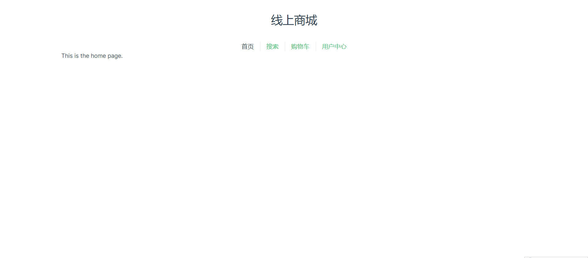

# 前端准备工作

## 1. 安装Node.js

可以跟随这个教程进行安装。注意需要安装Node.js的LTS 20.9.0版本。

<https://www.liaoxuefeng.com/wiki/1022910821149312/1023025597810528>

## 2. 克隆这个仓库到本地

使用GitHub Desktop或者Git命令行工具克隆这个仓库到本地。

项目的前端代码在`mallFront`目录下，后端代码在`mallBack`目录下。

## 3. 安装依赖包

在`mallFront`目录下执行`npm install`命令安装依赖包。下面是详细步骤：

### 检查目录是否正确

打开终端，检查当前目录是否为`mallFront`目录。

~~~
PS ...\2021HYSE08-mall\mallFront>
~~~

如果当前目录是'2021HYSE08-mall'，则需要运行`cd mallFront`命令进入`mallFront`目录。

~~~
PS ...\2021HYSE08-mall> cd mallFront
PS ...\zPersonal\Univ\CODE\2021HYSE08-mall\mallFront> 
~~~

运行`npm install`命令，安装依赖包。

~~~
npm install
~~~

## 4. 启动项目

如果这个前端项目可以正确启动，则说明环境配置已经完成。确认1-3步骤都正确后，使用下面的命令启动项目。

~~~
npm run dev
~~~

程序给出下面的提示：

~~~
PS ...\2021HYSE08-mall\mallFront> npm run dev

> mallfront@0.0.0 dev
> vite

Re-optimizing dependencies because lockfile has changed

  VITE v5.2.11  ready in 515 ms

  ➜  Local:   http://localhost:5173/
  ➜  Network: use --host to expose
  ➜  press h + enter to show help

~~~

现在可以访问<http://localhost:5173/>，看到首页，则说明安装成功。

## 5. 基本用法

请一定要阅读以下文档，了解Vue的模板语法与组件基础。重点是：`{{ }}`括号的作用，`v-bind` 和 `:`，
`v-on` 和 `@`，`v-model`，`v-for`，`v-if`，`v-else`，`v-else-if`，`v-show`。

[1] Vue 模板语法 <https://cn.vuejs.org/guide/essentials/template-syntax.html>

[2] Vue 组件基础 <https://cn.vuejs.org/guide/components/introduction.html>

下图这个目录里是一些视图，之后你们需要完成他们的`<template>`与`<style>`部分。

