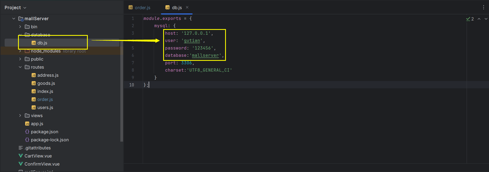
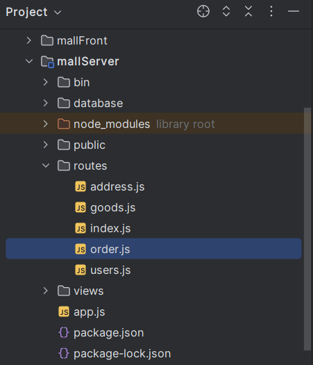
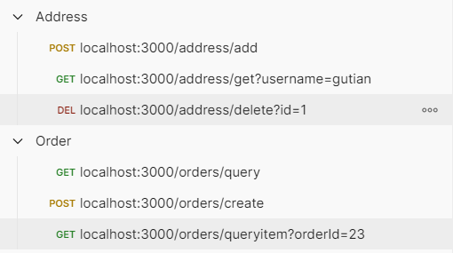

# 后端接口说明

端口：3000

需要安装mysql 8.0以上版本，并根据实际情况修改数据库配置。


需要手动创建数据库。表格可以根据下面的建表接口进行创建。

后端路由代码的逻辑在`mallServer/src/routes`路径下。


在`mallServer`中，执行：
```bash 
npm install
npm run dev
```
运行后端服务器。可以与前端服务器同时运行。

前端中，在`mallFront/src/api`中先封装API，再在具体的页面或模块中调用。可以参考用户接口的使用方式。

Postman是一个非常不错的接口调试工具。当然也可以用其他方式测试。


## 用户接口

by 顾田

| 接口名               | 方式   | 参数                 | 说明                          |
|-------------------|------|--------------------|-----------------------------|
| /users            | GET  | 无                  | 测试数据库连接                     |
| /users/login      | POST | username, password | 登录，保存用户端Username到服务器Session |
| /users/register   | POST | username, password | 注册                          |
| /users/logout     | GET  | 无                  | 登出，清除服务端Session             |
| /users/checklogin | GET  | 无                  | 通过Session检查登录状态             |

### 关于登录/登出

用户登录成功后，服务器会在服务端创建一个新的Session，登出时销毁。


### 调用说明

在`@/api/user.js`中，已封装这些接口。

## 地址接口

| 接口名             | 方式   | 参数                                  | 说明            |
|-----------------|------|-------------------------------------|---------------|
| /address        | GET  | 无                                   | 创建地址表（执行建表语句） |
| /address/add    | POST | username, name, phone, city, street | 添加地址          |
| /address/delete | POST | id                                  | 删除地址          |
| /address/get    | GET  | username                            | 获取地址          |

## 商品接口

| 接口名           | 方式  | 参数             | 说明            |
|---------------|-----|----------------|---------------|
| /goods        | GET | 无              | 创建商品表（执行建表语句） |
| /goods/all    | GET | 无              | 查看所有商品        |
| /goods/search | GET | keyword        | 搜索商品          |
| /goods/page   | GET | page, pageSize | 分页查看商品        |

## 订单接口

| 接口名               | 方式   | 参数                                                                             | 说明            |
|-------------------|------|--------------------------------------------------------------------------------|---------------|
| /orders           | GET  | 无                                                                              | 创建订单表（执行建表语句） |
| /orders/create    | POST | username, date, total, address, orderTime, completionTime, goods(Array), goods | 创建订单          |
| /orders/query     | GET  | username                                                                       | 根据用户名查询订单     |
| /orders/queryitem | GET  | orderId                                                                        | 用订单ID查询订单详情   |         |